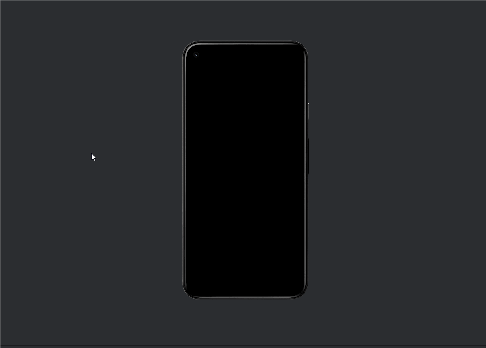

# AND101 Project 2 - Kotlin Debug-a-thon

Submitted by: **Rahat Moktadir**

Time spent: **5** hours spent in total

## Summary

**Bug Smasher** is an Android app that was riddled with some pretty nasty Kotlin bugs. 
With those gone, it's now a smooth collection of helpful and fun widgets, including number sum, color generation, and daily date checkers. 
The project was focused on understanding Kotlin syntax and fixing key issues like `NullPointerException`, `ClassCastException`, and array indexing errors. 
It really sharpened my ability to debug under pressure and write safer, more idiomatic Kotlin code.

If I had to describe this project in three (3) emojis, they would be: 🐛🧠🔧

## Application Features

<!-- (This is a comment) Please be sure to change the [ ] to [x] for any features you completed.  If a feature is not checked [x], you might miss the points for that item! -->

The following REQUIRED features are completed:

- [x] 👋 Debug and fix navigation to Hello World activity
- [x] 4️⃣ Debug and fix Number Sum (2 + 2) activity
- [x] 📅 Debug and fix Current Day activity 
- [x] 🌈 Debug and fix behavior of Random Color activity
- [x] 🗒️ Debug and fix Print List activity
- [x] 💯 Debug and fix Favorite Number activity

The following STRETCH features are implemented:

- [ ] TODO

The following EXTRA features are implemented:

- [ ] N/A

## Video Demo

Here's a video / GIF that demos all of the app's implemented features:

GIF created with **LiceCap**

## Notes

Throughout this project, I gained a much deeper appreciation for Kotlin's null-safety system and the importance of type safety in Android development. 
Fixing crashes due to improper casting, unguarded recursion, and null misuse helped solidify some key best practices. 
Also, Kotlin's clean syntax for collections (like `joinToString`) is just *chef's kiss* 👨‍🍳.

## License

Copyright **2025** **Rahat Moktadir**

Licensed under the Apache License, Version 2.0 (the "License");
you may not use this file except in compliance with the License.
You may obtain a copy of the License at

    http://www.apache.org/licenses/LICENSE-2.0

Unless required by applicable law or agreed to in writing, software
distributed under the License is distributed on an "AS IS" BASIS,
WITHOUT WARRANTIES OR CONDITIONS OF ANY KIND, either express or implied.
See the License for the specific language governing permissions and
limitations under the License.
